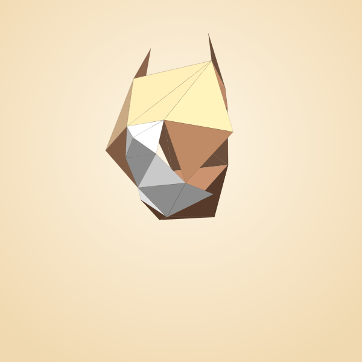
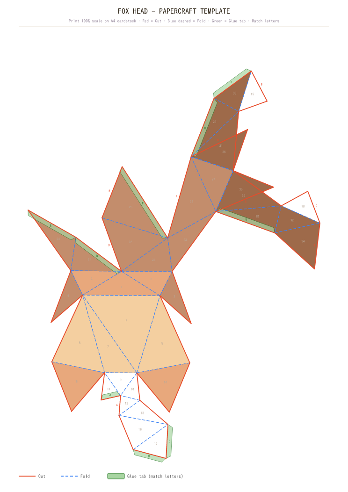
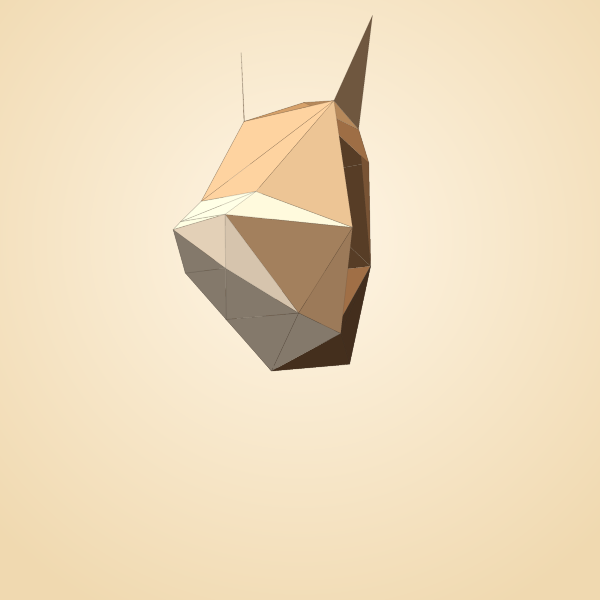
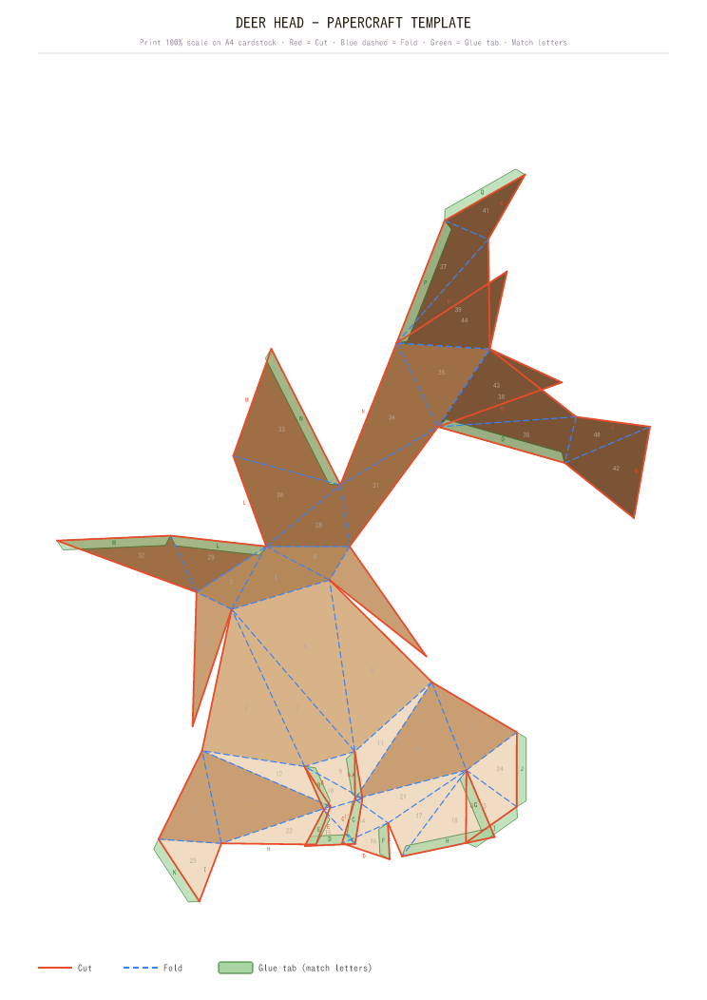
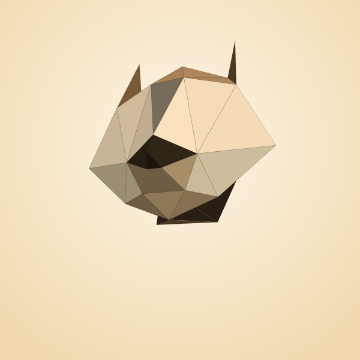
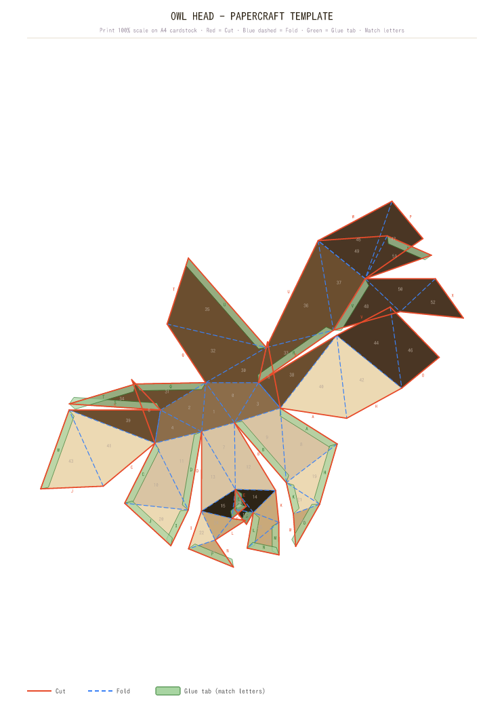

# PaperFold — Previews

Open this file on GitHub mobile, images render inline.

## Fox
3D model:


2D net (printable):


## Deer
3D model:


2D net (printable):


## Owl
3D model:


2D net (printable):


---

Each template fits A4 (744×1052 at 96dpi).
Red = cut, blue dashed = fold, green trapezoids = glue tabs (letter-matched pairs).
The 3D previews above are offline software-rendered from the parametric mesh
at default param values (all sliders at 50%).

To try the interactive editor locally:
```bash
git checkout claude/papercraft-unfold-app-UDPJA
npm install
npm run dev
```
